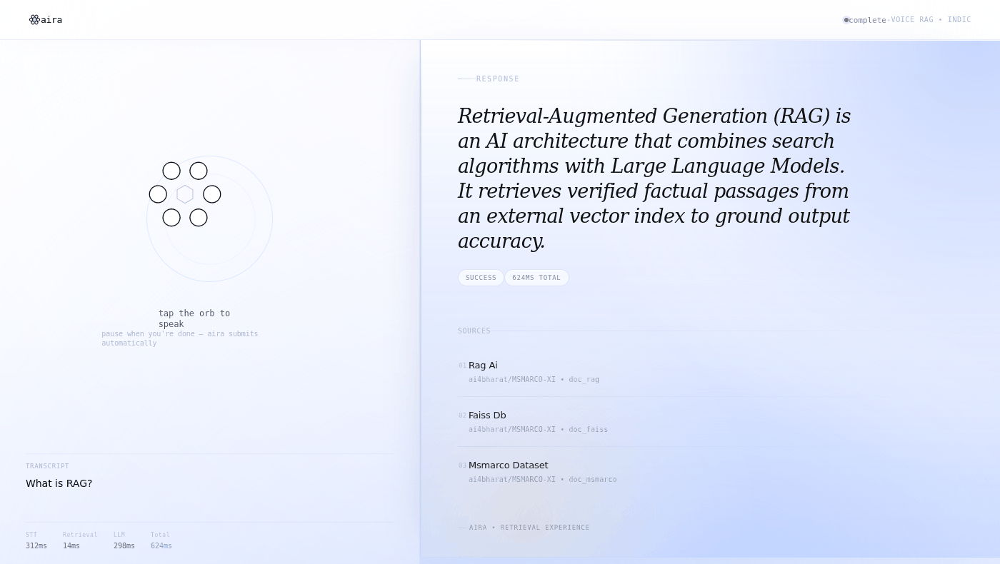
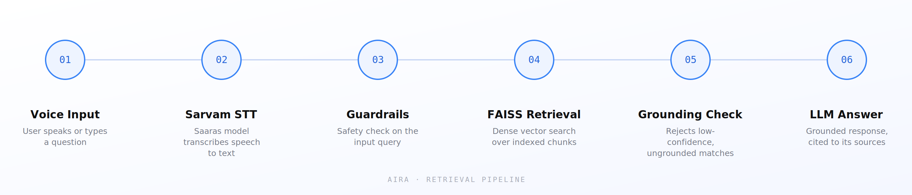

<div align="center">


# aira
### *The voice that knows.*

**Voice-native Retrieval-Augmented Generation for Indic languages.**
Speak a question. Get an answer it can prove.

[](https://www.python.org/)
[](https://fastapi.tiangolo.com/)
[](https://github.com/facebookresearch/faiss)
[](https://www.sarvam.ai/)
[](https://voice-rag-pipeline.onrender.com/)

[**Live Demo**](https://voice-rag-pipeline.onrender.com/) · [**Landing Page**](#) · [How it works](#how-it-works)

</div>

<br/>



<br/>

## What it does

aira listens to a spoken (or typed) question, transcribes it, searches a real knowledge base for the passages that actually answer it, and generates a response grounded in exactly what it found — with the sources shown alongside the answer, every time. No hallucinated guesses, no black box.

Built for Indic languages first: speech recognition runs on Sarvam AI's **Saaras** model, so the pipeline is voice-native rather than voice-bolted-on.

## Why "aira"

> **AIRA** *[EYE-rah]*
>
> **AI** + **RA** (Retrieval-Augmented) + **Air** — light, fast, premium. Four letters, easy to say, easy to remember.
>
> **Tagline:** *Aira — The voice that knows.*

## Features

- 🎙️ **Voice-native input** — press-to-speak, powered by Sarvam AI's Saaras speech-to-text model
- 🔍 **Real retrieval, not a guess** — dense vector search over a FAISS index, not a prompt stuffed with hope
- 🛡️ **Two-stage guardrails** — input safety check, then a grounding/confidence check before anything reaches the LLM
- 📎 **Cited sources** — every grounded answer comes back with the passages it was built from
- ⏱️ **Full latency breakdown** — STT, retrieval, guardrail, and LLM timing reported per request
- 🧩 **Multi-strategy chunking** — metadata-aware document chunking for better retrieval precision

## How it works



1. **Voice Input** — the user speaks or types a question
2. **Sarvam STT** — the Saaras model transcribes speech to text in real time
3. **Guardrails** — the input is checked for safety before anything else runs
4. **FAISS Retrieval** — the query is embedded and matched against a dense vector index
5. **Grounding Check** — low-confidence or ungrounded matches are rejected rather than answered anyway
6. **LLM Answer** — a response is generated, grounded in the retrieved passages, and returned with its sources

## Tech stack

| Layer | Technology |
|---|---|
| Backend | FastAPI (Python) |
| Speech-to-Text | Sarvam AI — Saaras model |
| Vector Search | FAISS |
| Embeddings | Sentence-transformer embeddings (all-MiniLM-L6-v2 class) |
| Orchestration | Custom pipeline harness with retry + guardrail stages |
| Frontend | Vanilla HTML/CSS/JS, static-served by FastAPI |
| Hosting | Render |

## Project structure

```
voice-rag-pipeline/
├── src/
│   ├── chunking/       # multi-strategy document chunking
│   ├── embeddings/     # embedding model wrapper
│   ├── guardrails/     # input safety + grounding/confidence checks
│   ├── harness/        # pipeline orchestrator — wires every stage together
│   ├── ingestion/       # document/knowledge-base ingestion
│   ├── llm/             # LLM client for grounded generation
│   ├── retrieval/       # FAISS-backed dense retriever
│   ├── stt/              # Sarvam AI speech-to-text client
│   └── vectordb/        # FAISS vector store wrapper
├── static/               # frontend (index.html, style.css, app.js)
├── tests/
├── config.yaml
├── render.yaml
├── requirements.txt
└── main.py               # FastAPI app + /query endpoint
```

## Getting started

```bash
# clone
git clone <this-repo-url>
cd voice-rag-pipeline

# set up a virtual environment
python3 -m venv .venv
source .venv/bin/activate   # Windows: .venv\Scripts\activate

# install dependencies
pip install -r requirements.txt

# configure environment variables (see below)
cp .env.example .env        # then fill in SARVAM_API_KEY

# run locally
python main.py
# → http://127.0.0.1:8000
```

## Environment variables

| Variable | Required | Description |
|---|---|---|
| `SARVAM_API_KEY` | Yes | API key for Sarvam AI's speech-to-text service. Without it, voice queries fail — text queries still work. |

## API reference

### `POST /query`

Accepts **either** a text query or an audio file (multipart form data).

```bash
# text query
curl -X POST https://voice-rag-pipeline.onrender.com/query \
  -F "query_text=What is RAG?"

# voice query
curl -X POST https://voice-rag-pipeline.onrender.com/query \
  -F "audio_file=@question.wav"
```

**Response**

```json
{
  "query": "What is RAG?",
  "answer": "Retrieval-Augmented Generation (RAG) is an AI architecture that combines search algorithms with Large Language Models...",
  "grounded": true,
  "sources": [
    { "id": "doc_rag", "title": "Rag Ai", "meta": "ai4bharat/MSMARCO-XI • doc_rag", "text": "..." }
  ],
  "latency": {
    "stt_ms": 0.0,
    "embedding_ms": 0.0,
    "retrieval_ms": 12.4,
    "guardrail_ms": 3.1,
    "llm_ms": 610.2,
    "total_ms": 625.7
  },
  "status": "success"
}
```

`status` is one of `success`, `rejected_by_guardrail`, `refused_low_confidence`, or `error` — a silent or failed voice input never falls back to a guessed answer; it returns `error` with a clear message instead.

## Deployment

Configured for [Render](https://render.com/) via `render.yaml`. Push to your connected branch and Render builds and deploys automatically; set `SARVAM_API_KEY` in the Render dashboard under **Environment**.

## Links

- **Live app:** [voice-rag-pipeline.onrender.com](https://voice-rag-pipeline.onrender.com/)
- **Landing page repo:** aira-landing *(separate repo — static marketing site, links back here)*

<br/>

<div align="center">
<sub>AIRA · RETRIEVAL EXPERIENCE</sub>
</div>
